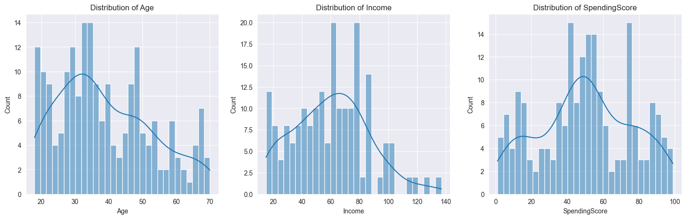
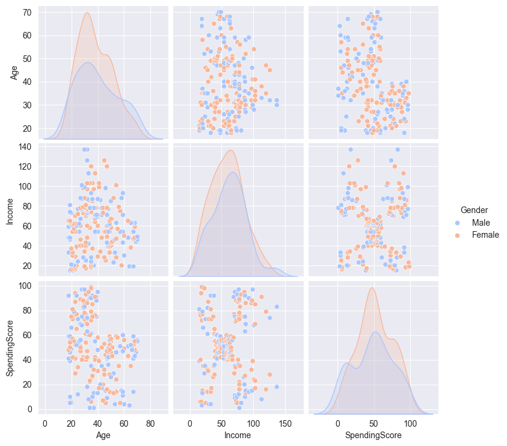
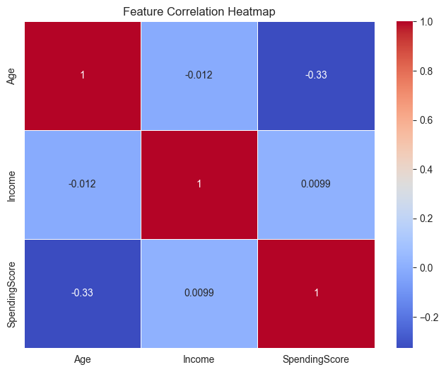
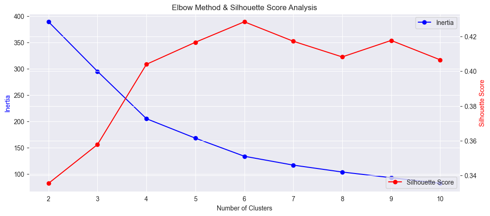
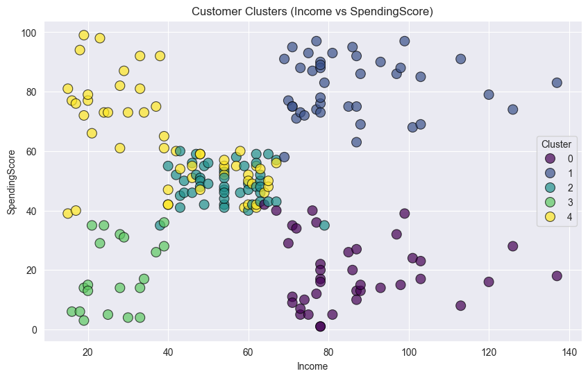
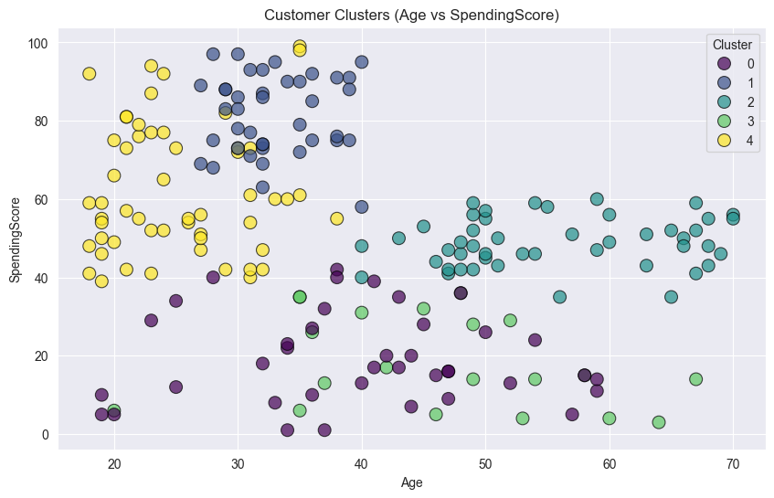
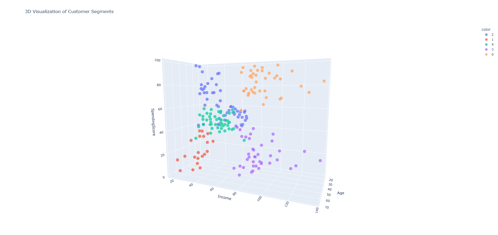

# Customer Segmentation and Analysis - Revamped Version

This project performs customer segmentation on the Mall Customers dataset using K-Means clustering. The analysis includes data exploration, visualization, and clustering evaluation. The code has been structured in a modular fashion to improve readability and scalability.

## Table of Contents

- [Overview](#overview)
- [Installation](#installation)
- [Dataset](#dataset)
- [Project Structure](#project-structure)
- [Visualizations](#visualizations)
- [Usage](#usage)
- [Output](#output)
- [Acknowledgements](#acknowledgements)
- [License](#license)

## Overview

The project workflow includes:

1. **Data Overview & Preprocessing:**  
   - Loading the dataset.
   - Renaming columns for clarity.
   - Checking for missing values and exploring basic statistics.

2. **Exploratory Data Analysis (EDA):**  
   - Generating distribution plots for key features (Age, Income, SpendingScore).
   - Creating pair plots to explore relationships among variables (including Gender).
   - Producing a correlation heatmap to visualize feature correlations.

3. **Clustering Analysis:**  
   - Finding the optimal number of clusters using the Elbow Method and Silhouette Score.
   - Applying K-Means clustering with feature scaling.
   - Displaying clusters using both 2D and interactive 3D visualizations.

4. **Visualization:**  
   - 2D scatter plots of clusters in different feature spaces.
   - An interactive 3D plot using Plotly (optimized for VSCode).

## Installation

Ensure you have Python 3.7+ installed along with the following packages:

- numpy
- pandas
- matplotlib
- seaborn
- plotly
- scikit-learn
- nbformat

You can install the required packages using:

```bash
pip install -r requirements.txt
```

If you do not have a `requirements.txt`, you can create one with the above packages.

## Dataset

The project uses the **Mall Customers** dataset. Make sure that the file `Mall_Customers.csv` is in the root directory of the repository, or update the file path accordingly in the code.

## Project Structure

A suggested project structure is as follows:

```
├── README.md
├── Mall_Customers.csv
├── customer_segmentation.py         # or Jupyter Notebook (.ipynb)
├── images/
│   ├── distribution_plots.png       # Histograms for Age, Income, SpendingScore
│   ├── pairplot.png                 # Pairplot including Gender
│   ├── correlation_heatmap.png      # Heatmap of feature correlations
│   ├── elbow_silhouette.png         # Elbow and silhouette score plot for optimal clusters
│   ├── cluster_scatter_income_spend.png  # 2D cluster scatter (Income vs SpendingScore)
│   ├── cluster_scatter_age_spend.png       # 2D cluster scatter (Age vs SpendingScore)
│   └── 3d_cluster_visualization.png # Screenshot of interactive 3D visualization (if needed)
```

## Visualizations

The following visualizations are generated by the code:

1. **Distribution Plots:**  
   - **Description:** Histograms with KDE for `Age`, `Income`, and `SpendingScore`.  
   

2. **Pair Plot:**  
   - **Description:** Pairwise relationships among `Age`, `Income`, `SpendingScore`, and `Gender`.  
   

3. **Correlation Heatmap:**  
   - **Description:** Heatmap showing correlations between features.  
   

4. **Elbow Method & Silhouette Score Plot:**  
   - **Description:** Dual-axis plot to help determine the optimal number of clusters.  
   

5. **2D Cluster Visualizations:**  
   - **Description:** Scatter plots showing cluster segmentation on two different feature combinations:
     - Income vs. SpendingScore
         
     - Age vs. SpendingScore
         

6. **3D Cluster Visualization:**  
   - **Description:** An interactive Plotly 3D scatter plot.  
   

## Usage

To run the project, use either a Jupyter Notebook or execute the Python script. For example, from the command line:

```bash
python customer_segmentation.py
```

If you're using VSCode's interactive window, open the notebook and run all cells.

## Output

The console output will include:
- Dataset overview (shape, column info, and missing values).
- Silhouette scores for different cluster counts.
- Plots for EDA and clustering.

## Acknowledgements

- [scikit-learn KMeans Documentation](https://scikit-learn.org/stable/modules/generated/sklearn.cluster.KMeans.html)
- [Seaborn Documentation](https://seaborn.pydata.org/)
- [Plotly Express Documentation](https://plotly.com/python/plotly-express/)
- [Pandas Documentation](https://pandas.pydata.org/)
- [Matplotlib Documentation](https://matplotlib.org/)
